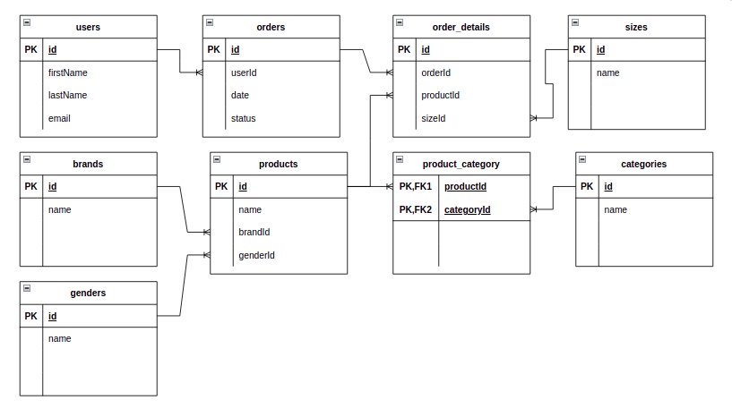

# compact-sequelize

```sh
npm install compact-sequelize
```
## Overview

<p> The goal of compact-sequelize is to make the objects returned by the sequelize ORM more readable and manageable. And secondly apply the toJSON method recursively.<p>

<p> We often want to get a single field from linked tables. Although sequelize allows us to achieve this, the resulting structure has unnecessary complexity.</p>

<p>As an example we will get orders and their details. For each order, the user (email), product detail, brand (name), gender (name), and product categories (name).</p>

<p align='center'>
    
</p>

<p>The corresponging sequelize code</p>

```js
Order.findAll({
  include: [
    { model: User, attributes: ["email"] },
    {
      model: OrderDetail,
      include: [
        {
          model: Product,
          include: { model: Brand, attributes: ["name"] },
          include: { model: Gender, attributes: ["name"] },
          include: { model: Category, attributes: ["name"] },
        },
        { model: Size, attributes: ["name"] }
      ]
    }
  ],
})
```

and we get a json like this:

```js
[{
  "id": 42,
  "date": "2022-01-27T07:54:02.571Z",
  "status": "carrito",
  "userId": 12,
  "user": {
    "email": "andres@sportbase.com"
  },
  "OrderDetails": [
    {
      "id": 197,
      "price": 10999,
      "quantity": 2,
      "orderId": 42,
      "productId": "c2fcdddd-2ea4-465a-939a-63d91bb60aa0",
      "sizeId": 12,
      "product": {
        "id": "c2fcdddd-2ea4-465a-939a-63d91bb60aa0",
        "name": "Adidas jacket Firebird",
        "price": 10999,
        "genderId": 2,
        "brandId": 1,
        "brand": {
          "name": "Adidas"
        },
        "gender": {
          "name": "Woman"
        },
        "categories": [
          {
            "name": "jacket",
            "product_category": {
              "createdAt": "2022-01-20T02:05:12.939Z",
              "updatedAt": "2022-01-20T02:05:12.939Z",
              "productId": "c2fcdddd-2ea4-465a-939a-63d91bb60aa0",
              "categoryId": 5
            }
          },
          {
            "name": "sportswear",
            "product_category": {
              "createdAt": "2022-01-20T02:05:12.939Z",
              "updatedAt": "2022-01-20T02:05:12.939Z",
              "productId": "c2fcdddd-2ea4-465a-939a-63d91bb60aa0",
              "categoryId": 9
            }
          }
        ]
      },
      "size": {
        "name": "XL"
      }
    }
  ]
}]
```
<p>compact-sequelize is particularly useful in many-to-many relationships such as product and category relationships.</p>

<p>Finally we apply the compact function to the sequelize object/array.<p>

```js
const { compact } = require('compact-sequelize');
const { Order, User, OrderDetail, Size, Product, Gender, Brand, Category } = require("./src/db.js");

const getOrders = async () => {

  const orders = compact(await Order.findAll({
    include: [
      { model: User, attributes: ["email"] },
      {
        model: OrderDetail,
        include: [
          {
            model: Product,
            include: { model: Gender, attributes: ["name"] },
            include: { model: Brand, attributes: ["name"] },
            include: { model: Category, attributes: ["name"] }
          },
          { model: Size, attributes: ["name"] }
        ]
      }
    ],
  }));

  return orders;
}
```

<p>Next we get a more concise object</p>

```js
{
  "id": 42,
  "date": "2022-01-27T07:54:02.571Z",
  "userId": 12,
  "user": "andres@sportbase.com",
  "OrderDetails": [
    {
      "id": 197,
      "price": 10999,
      "quantity": 2,
      "orderId": 42,
      "productId": "c2fcdddd-2ea4-465a-939a-63d91bb60aa0",
      "sizeId": 12,
      "product": {
        "id": "c2fcdddd-2ea4-465a-939a-63d91bb60aa0",
        "name": "Adidas jacket Firebird",
        "price": 10999,
        "genderId": 2,
        "brandId": 1,
        "brand": "Adidas",
        "gender": "Woman",
        "categories": [
          "jacket",
          "sportswear"
        ]
      },
      "size": "XL"
    }
  ]
}
```